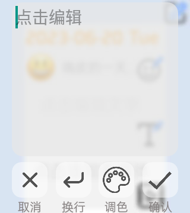
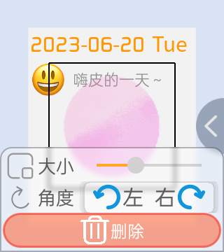

# 安装流程

您可以在 **小天才应用商店** 或者是在 **我们的Github仓库上** 下载我们最新的应用程序。

:::tip

小天才上架版本因商店方要求部分功能受限（如密码功能），建议您在设备上安装Github版本，
以便体验最完整的“每日手帐”体验。

:::

## 环境要求

- Android操作系统版本建议不低于**7.1.1**。您可以在“关于设备”选项中查看您的系统版本（注意：系统版本并不是”ColorOS For Watch、CaremeOS“之类的UI版本，而是”Android版本“）。

## 下载应用程序

使用计算机上的命令行文本你可以轻易地在手表上安装我们的软件。你可以在空仓库或现有仓库的任何地方使用这个命令，它会自动从Github仓库上拉取最新软件源代码。

```bash
git clone https://github.com/HaoduyouduStudio/DailyNotes
```

你可以使用我们提供的配置文件制作的”每日手帐“，在你熟悉了打包软件后你可以自己配置软件设置项从而获得属于自己的”每日手帐“。

:::info 提示

大部分情况下，我们的工作人员通常会把已打包好的apk文件放置在源代码的 `/app/release` 文件夹中

若我们没有提供相应的apk，您可以在Github的 `release` 页面内获取最新稳定版本或测试版本。

:::

:::tip 对于小天才用户

手表端:您可以在”应用商店“中的"生活便利"分类中找到我们的软件。

家长端:在”更多"的"应用中心"页面内，您可以在首页banner(即顶部类广告图片)的"少年开发者来了"推广页面中，找到我们的软件。
同时也可以在分类中找到我们的软件（与手表端分类相同）。

:::

获取apk之后即可通过 `adb` 工具在手表上安装软件，详细请参考互联网上的教程。

## 创建手帐

刚进入软件时我们会向你索要一些必需权限，您需要完全授权才可体验到完整的每日手帐应用程序。

:::note 须知

本站点所有教程均以每日手帐2.0.3及以上版本为基础制作。

:::

进入**菜单栏**（图标位于屏幕的右上角处），单击🖊图标后你将会进入心情选择页。

在该页面中，你可以选择我们提供的预设表情和描述，也可以在“更多表情”中自己选择其它受支持的Emoji图案作为心情，再在第二页中填写心情描述。


在选择完心情后，我们随即进入“手帐编辑页”。

手帐可编辑内容分为四大块：**文字、多媒体、模板和贴纸**


#### 文字

在手帐编辑页中你可以找到”**点击编辑文字**“字样，单击该文字即可快速进入文字编辑页面。

在文字编辑页中你可以**添加文字、换行、调整字体颜色以及确认修改**。

单击”**点击编辑**“后，软件会唤起系统预设输入法，在输入完毕后你可以保存修改或进一步调整字体颜色。

我们提供12种预设颜色供用户自定义（暂不支持自定义色块）。



#### 多媒体

你可以在手帐中添加多媒体内容，我们支持**相片、小视频和录音文件**。

*注：相片及视频需要设备支持

- 选择“拍照”，软件会调用系统拍摄组件，用户操作完成后即可加入到手帐中
- 选择“相册”，软件会调用系统相册，用户需在页面中选择相片，确认后即可导入到手帐中
- 选择“小视频”，软件同样会调用系统拍摄逐渐，步骤与“拍照”模块相同
- 选择“录音”，软件会弹出弹窗并显示“点击录音”按钮。单击此按钮开始录音，用户操作结束录音或达到限时时我们会停止录音。

我们保证不会将任何与个人隐私有关数据流露给第三方，因为我们也无法取得这些数据。所以请不用担心您的数据被泄露。
但我们无法保证“广东小天才科技有限公司”的行为，若发现如上行为均与我们（即DailyNotes Team）无任何关联。
详细请参见手表端“隐私协议”。

#### 模板

在手帐的最右上端有🖊按钮，单击此按钮即可进入模板选择页。

在该页中你可以自由选择我们提供的手帐模板，大部分由用户或美工创作。

未经过允许不得在其它平台上使用，我们将保留一切追究权利。

#### 贴纸

在以上内容填写（可不填写一部分内容）完毕后，软件将在右侧弹出类菜单栏类的选择栏，从上往下第2个花朵图标即为贴纸编辑按钮。

单击此按钮，即可进入贴纸编辑页。

在页面中选择你喜欢的贴纸，软件会自动将此贴纸加入在手帐当中。

单击你添加的贴纸，底部会弹出编辑栏。你可以调整贴纸**大小和角度**，也可以选择删除。



手帐编辑完成后选择页面中的✔图标直到退回到主页或没有按钮的手帐查看页面即可确认保存。

## 恭喜！

**恭喜你！创建了第一篇手帐！**

在2.0.5版本（小天才）中，你可以长按主页中的手帐打开”更多“功能页，选择”分享手帐“，
把手帐（图片形式）分享给自己的亲朋好友看看！

我们永远欢迎你的到来，这里永远会给你传授与”每日手帐“相关的知识！